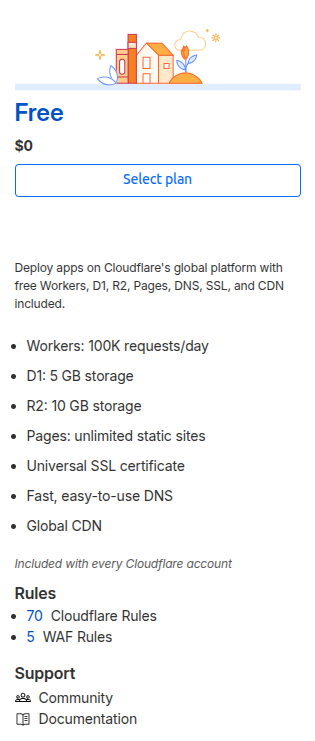

# CloudFlare

- CDN (Content Delivery Network) – Caches content on servers around the world so users get faster page loads.
- DNS – Converts domain names (like example.com) into IP addresses.
- DDoS Protection – Protects websites from large-scale attack traffic.
- WAF (Web Application Firewall) – Blocks common web attacks such as SQL injection and XSS.
- Zero Trust Security – Secure access to internal applications without a traditional VPN.
- Tunnel – Allows you to expose local applications to the internet securely without opening firewall ports.
- Load Balancing – Distributes traffic across multiple servers.
- Workers – Lets you run JavaScript, TypeScript, Python, and other code at Cloudflare's edge locations.

## Cloudflare free plan includes:

| Feature                        | Per Account or Per Domain?                     |
| ------------------------------ | ---------------------------------------------- |
| DNS                            | Per domain (each domain gets its own DNS zone) |
| SSL Certificate                | Per domain                                     |
| CDN                            | Per domain                                     |
| Workers (100K requests/day)    | **Per account**                                |
| D1 Database (5 GB)             | **Per account**                                |
| R2 Storage (10 GB)             | **Per account**                                |
| Pages (unlimited static sites) | **Per account/project**                        |
| Rules (70 Cloudflare Rules)    | Per domain (zone)                              |
| WAF Rules (5)                  | Per domain (zone)                              |

✅ Each domain gets:

- DNS
- SSL
- CDN
- 70 Rules
- 5 WAF Rules

But the following are shared across all domains in your account:

- 100,000 Worker requests/day
- 5 GB D1 storage
- 10 GB R2 storage
