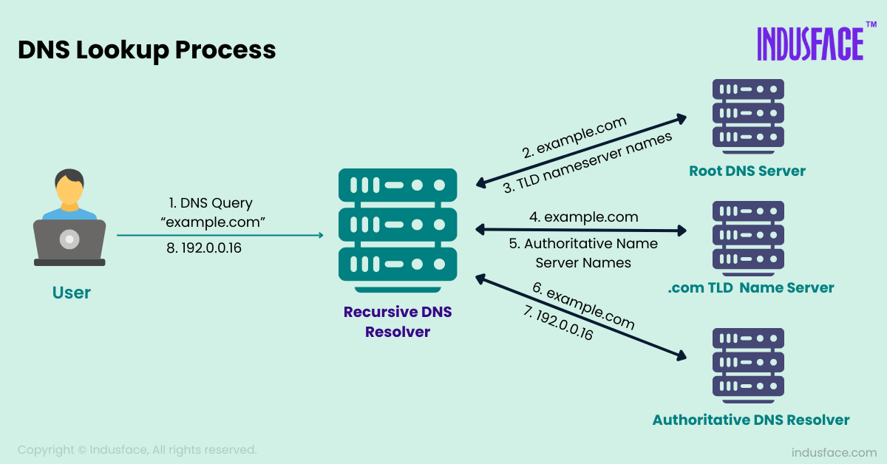

# DNS

## How DNS works

1. suppose you want to visit `https://api.example.com` in your browser, you will type the URL in the address bar and hit enter.
2. Your browser will check if it has the IP address of `api.example.com` in its cache. If it does, it will use that IP address to connect to the server. If not, it will proceed to the next step.
3. Your computer will check its OS cache for the IP address of `api.example.com`. If it finds it, it will use that IP address to connect to the server. If not, it will proceed to the next step.
4. Computer send to recursive resolver (usually provided by your ISP) a DNS query for `api.example.com`.
5. The recursive resolver will check its cache for the IP address of `api.example.com`. If it finds it, it will return that IP address to your computer. If not, it will proceed to the next step.
6. The recursive resolver will send a DNS query to the root DNS server and root DNS server will respond with the IP address of the TLD DNS server for `.com`.
7. The recursive resolver will send a DNS query to the TLD DNS server for `.com` and the TLD DNS server will respond with the IP address of the authoritative DNS server for `example.com`.
8. The recursive resolver will send a DNS query to the authoritative DNS server for `example.com` and the authoritative DNS server will respond with the IP address of `api.example.com`.
9. The recursive resolver will return the IP address of `api.example.com` to your computer.
10. Your computer will use the IP address to connect to the server and retrieve the content of `https://api.example.com`.



---

## DNS configured using Route53

- Create a hosted zone for your domain in Route53.
- Copy nameservers from the hosted zone and update your domain registrar with these nameservers.
- These are authoritative nameservers for your domain and will be used to resolve DNS queries for your domain.

```
ns-123.awsdns-11.com
ns-456.awsdns-22.net
ns-789.awsdns-33.org
ns-101.awsdns-44.co.uk
```

these are the authoritative nameservers for your domain.

```
1. Browser
      ↓
2. Recursive Resolver (1.1.1.1, 8.8.8.8, ISP DNS)
      ↓
3. Root Server
      ↓
4. .com TLD Server
      ↓
5. Route 53 Authoritative Nameserver
      ↓
6. Returns the actual DNS record
```

---

🛑 If your authoritative DNS is Cloudflare, the resolver talks to Cloudflare's globally distributed DNS network. Cloudflare is known for very low DNS response times because it has many data centers worldwide.
