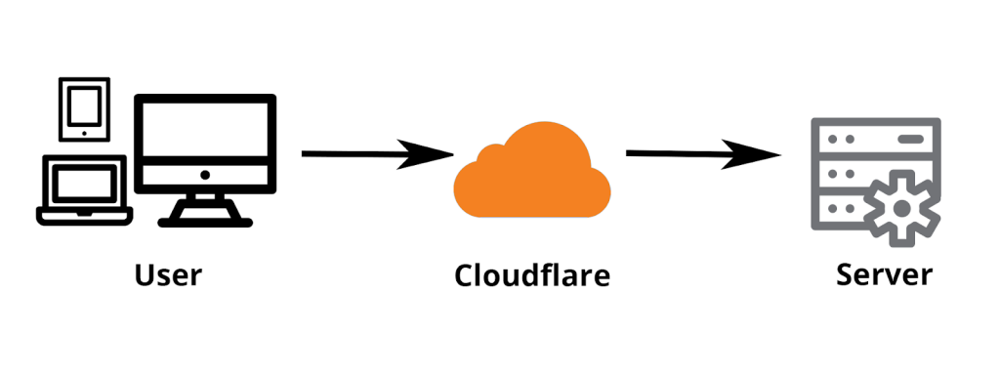
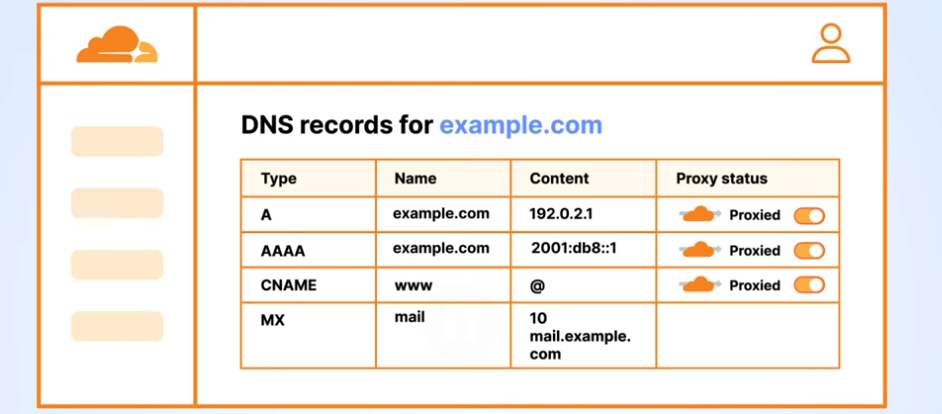

# CloudFlare Proxy

### 🛑 Cloudflare's proxy only handles HTTP/HTTPS traffic

## What is a reverse proxy

A reverse proxy is a server that sits in front of one or more backend servers and receives requests from clients on their behalf.

```
Browser
   |
   v
Reverse Proxy
   |
   +--> Web Server 1
   |
   +--> Web Server 2
   |
   +--> API Server

```

---

## Cloudflare as a reverse proxy



The visitor thinks they're talking to your website, but they're actually talking to Cloudflare first.
Cloudflare then forwards the request to your EC2 instance.

### Apply proxy to your domain in Cloudflare

To use Cloudflare as a reverse proxy, you need to enable the proxy setting for your domain's DNS record in the Cloudflare dashboard. This is done by toggling the cloud icon next to your DNS record to orange (proxied) instead of gray (DNS only).

- In Cloudflare, the proxy setting is applied per DNS record, not for the entire DNS zone.



### Benefits of using Cloudflare as a reverse proxy

1. Hides your origin server's real IP address, making direct attacks harder

Because all traffic goes through Cloudflare, attackers cannot easily discover your server's IP address to target it directly. This adds an extra layer of security against DDoS attacks and other malicious activities.

2. DDoS protection at the network and application layer

Cloudflare sits in front of your server with massive global capacity, so it can absorb volumetric attacks that would otherwise saturate your server's bandwidth or crash it. It uses traffic pattern analysis to detect anomalies (sudden spikes, repetitive patterns, malformed requests) and automatically filters or challenges suspicious traffic before it reaches you. This is largely automatic and included even on the free tier for basic protection.

3. Web Application Firewall (WAF) to block malicious requests

Cloudflare maintains rulesets (managed rules) based on known vulnerability signatures (similar to how antivirus software uses signatures), and updates them as new threats emerge. You can also write custom rules — e.g., block any request containing a specific suspicious string, or block requests to /wp-admin if you're not running WordPress. This matters because it catches malicious requests at the edge, before they ever hit your server or database, reducing exposure even if your own application code has bugs

4. Bot Management

The free tier gives basic bot fighting; the paid Bot Management product gives much more granular scoring and control (e.g., allow good bots like Googlebot, block scrapers, throttle suspicious traffic)

5. Free SSL/TLS certificates with easy HTTPS enforcement

It issues a free certificate (via Let's Encrypt or its own CA) and handles renewal automatically — no manual cert management
It can encrypt the connection between the visitor and Cloudflare even if your origin server only supports HTTP — though for full security you also want encryption between Cloudflare and your origin (this is the "SSL/TLS encryption mode" setting: Flexible, Full, or Full Strict — Full Strict is the most secure since it validates your origin's certificate too)
