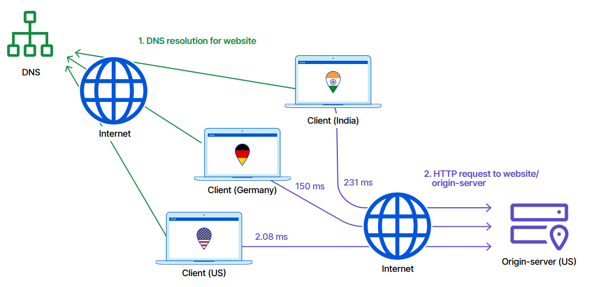
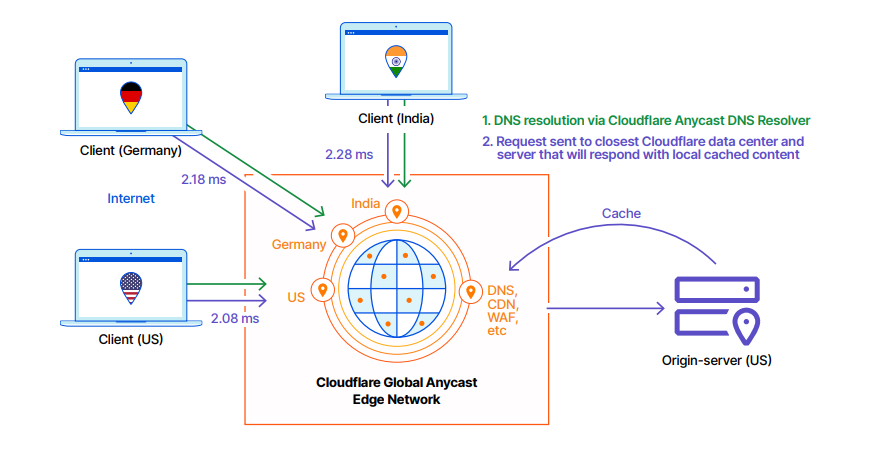
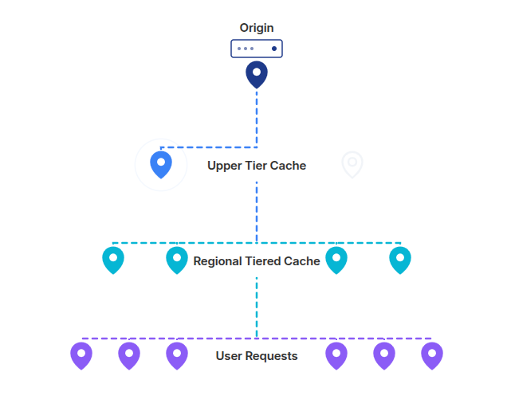

# Cloudflare CDN

## Before CDN

- Before CDN , first we use DNS to resolve the domain name to the IP address of the server, then we send a request to the server, and the server will return the response to us.

- For for the users that lives in the same continent with the server, the latency is not that high, but for the users that lives in the different continent with the server, the latency is very high.

## After CDN

- After CDN, we use DNS to resolve the domain name to the IP address of the nearest CDN node, then we send a request to the CDN node, and the CDN node will return the response to us.

- Users on the same continent as the origin server already have decent latency even without a CDN. Users on a different continent benefit the most from a CDN, because instead of reaching all the way to the origin, they now hit a nearby edge node — turning what would've been high latency into low latency.

---

- 🛑 By default Standard Caching is enabled

## Tiered Caching

### Upper Tier

- without tiered cache, every Cloudflare edge node that gets a cache miss would go straight to your origin to fetch the content. If you have edge nodes all over the world, that's a lot of separate connections hammering your origin — even for the same file.

#### With upper tier cache enabled:

- One or a few upper tier data centers (chosen to be close to your origin) act as a middle layer.
- When an edge node near a user has a cache miss, it doesn't go to your origin directly — it asks the upper tier first.
- If the upper tier already has the content cached (because some other edge node fetched it earlier), it serves it from there.
- Only if the upper tier also doesn't have it does a request finally reach your origin.

### Regional Tier

Regional Tiered Cache adds an extra layer between the user-facing edge nodes and the upper tier — it's a middle step that's regional, meaning closer to groups of users rather than close to your origin.

#### With regional tier cache enabled:

- A user request hits a nearby edge node (purple pins).
- Cache miss → instead of jumping straight up to the Upper Tier (which is near your origin, possibly far away), it first checks a regional data center (cyan pins) that's geographically closer to that cluster of users.
- If the regional cache has it (because another nearby edge node already fetched it), it's served from there — fast, with minimal distance traveled.
- Only if the regional tier also misses does the request continue up to the Upper Tier Cache, and from there to the origin if needed.
