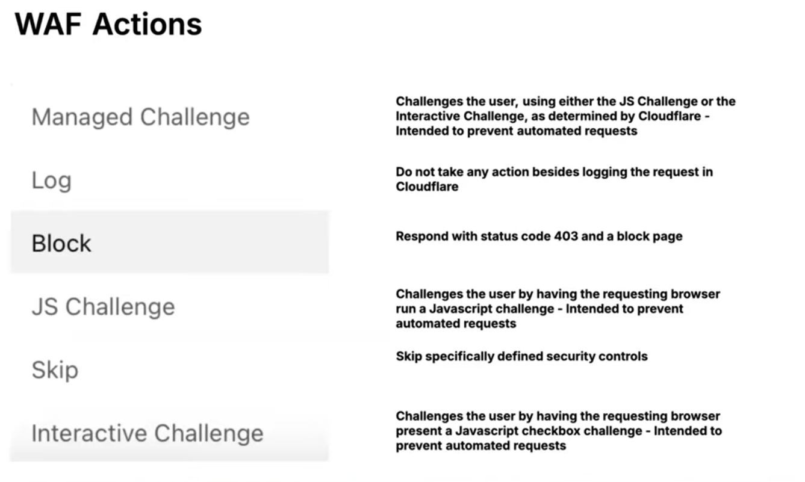
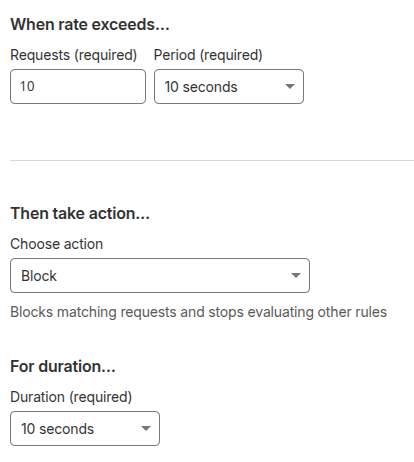

# Web Application Firewall (WAF)

Cloudflare's WAF primarily operates at Layer 7 (Application layer) — that's its core purpose and what distinguishes it from a regular firewall.

- It inspects the actual HTTP/HTTPS request content — URL paths, query strings, headers, cookies, request body (POST data, JSON payloads, etc.).
- It detects application-level attack patterns: SQL injection, XSS, command injection, malicious payloads hidden in form submissions, etc.
- But practically, Cloudflare's WAF also lets you write conditions using Layer 3/4 attributes (IP address, ASN, country derived from IP, etc.) as part of a Layer 7 rule.

## How cloudflare read data if data is encrypted?

- Cloudflare terminates the TLS connection at its edge. It's not magically reading encrypted data without decrypting it — it decrypts it first, inspects it, then re-encrypts before sending it onward (if needed).

### Steps

- User → Cloudflare edge: The user's browser establishes a TLS connection with Cloudflare, not with your origin server directly. Cloudflare holds the SSL/TLS certificate for your domain (either one it issues for you via its Universal SSL, or one you upload). So the encrypted handshake terminates right there at Cloudflare's data center.
- Decryption happens at the edge: Once the TLS session is established, Cloudflare can decrypt the request. Now it's plain HTTP again, in memory, briefly — this is exactly the point where the WAF, bot management, caching, etc., can actually read the URL paths, headers, body content and act on it.
- Cloudflare → Origin: After processing, Cloudflare re-encrypts (if you're using "Full" or "Full (Strict)" SSL mode) and opens a new TLS connection to your origin server. This is a separate encrypted tunnel — the original encryption from the user never actually reaches your origin; Cloudflare re-wraps it.

```
User <--TLS #1--> Cloudflare Edge <--TLS #2--> Origin Server
```

## WAF Actions



- Managed Challenge

Cloudflare looks at signals about the request (browser fingerprint, behavior, IP reputation, etc.) and decides for you whether to show a JS Challenge or an Interactive Challenge — whichever is appropriate for that specific visitor. This is the recommended default for most "suspicious but not definitely malicious" traffic, because Cloudflare's heuristics adapt over time rather than you hardcoding one challenge type. Real users with normal browsers usually pass invisibly; bots without a full JS engine get stuck.

- Log

Pure observation mode — the request is allowed through completely untouched, but a record of it shows up in your WAF Security Events log. This is what you use while testing a new rule before committing to Block or Challenge. You write a rule, set the action to Log, watch it for a few days to make sure it's not catching legitimate traffic, then flip it to Block once you trust it.

- Block

The hard stop. The request never reaches your origin — Cloudflare immediately returns an HTTP 403 Forbidden with a generic block page. No challenge, no second chance. Use this for things you're certain are malicious: known bad IPs, exploit attempts, requests to endpoints that should never be hit by real users (e.g. /wp-admin on a site that isn't WordPress).

- JS Challenge

Forces the browser to execute a small JavaScript snippet and return a token proving it could do so. Real browsers do this instantly and invisibly to the user. Most basic bots/scripts (using raw curl, requests in Python, etc.) don't run JavaScript at all, so they fail here. It's lighter-weight than Managed/Interactive Challenge — no visible CAPTCHA-like box — but also easier for slightly more sophisticated bots (using headless Chrome, Puppeteer, etc.) to bypass.

- Skip

This one's different — it doesn't challenge or block anything. It tells Cloudflare to bypass specific security features for requests matching this rule. Example: you might have a legitimate internal monitoring tool that keeps getting flagged by the WAF's managed rules. Instead of disabling those rules globally, you write a custom rule matching that monitoring tool's IP/user-agent and set the action to "Skip" → "WAF Managed Rules" so it sails through without being blocked, while everyone else still gets the protection.

- Interactive Challenge

The visible "I'm not a robot" checkbox-style challenge (similar to a CAPTCHA, though Cloudflare's version is generally less annoying than older reCAPTCHA). This is the most disruptive to a real user's experience, so it's reserved for traffic Cloudflare considers genuinely high-risk — not used as a first line of defense for everything.

## Rate Limiting Rules

- Rate Limiting Rules let you control how many requests a client can make to a specific part of your site within a given time window — and what happens when they exceed it.
  The core idea:

- Instead of blocking/allowing based on what a request contains (like WAF rules do), rate limiting looks at how often a particular client is making requests. If someone (or something) is hammering an endpoint way faster than a normal human would, that's a strong signal of abuse — even if each individual request looks harmless on its own.



- This is the trigger condition. Cloudflare counts how many matching requests come from the same client (by default, grouped by IP) within a rolling 10-second window. The moment that count hits 11 (the 10th request is still allowed; the 11th is what crosses the threshold), the rule fires.

- "Then take action..." → Block

## Managed Rules

- Cloudflare's WAF includes a set of pre-configured "Managed Rules" that cover common vulnerabilities and attack patterns. These are maintained and updated by Cloudflare's security team, so you get ongoing protection against new threats without having to write custom rules for every new exploit.

- Examples of Managed Rule sets include:
  - Cloudflare Managed Ruleset: Created by the Cloudflare security team, this ruleset provides fast and effective protection for all of your applications. It covers known attack techniques and zero-day vulnerabilities (newly discovered flaws with no available patch). The ruleset is updated frequently to address new threats and reduce false positives (legitimate requests incorrectly flagged).

  - Cloudflare OWASP Core Ruleset: Cloudflare's implementation of the Open Web Application Security Project (OWASP) ModSecurity Core Rule Set. This ruleset uses a scoring model — each matching rule adds its score to a cumulative threat score, and the WAF executes the configured action when the score exceeds the threshold.

  - Cloudflare Exposed Credentials Check: Deploys an automated credentials check on your end-user authentication endpoints. For any credential pair, the Cloudflare WAF performs a lookup against a public database of stolen credentials to determine if they were previously compromised. Cloudflare recommends that you use leaked credentials detection instead of this ruleset.

  - Cloudflare Free Managed Ruleset: Available on all Cloudflare plans. Provides protection against high-impact and widely exploited vulnerabilities. The rules are safe to deploy on most applications. If you have already deployed the Cloudflare Managed Ruleset, you do not need this ruleset — the Cloudflare Managed Ruleset includes broader coverage.
