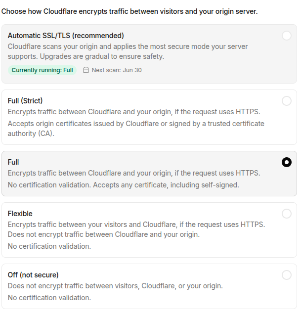

# SSL Certificate

## Encryption mode and origin connection settings

### Create Full (Strict) SSL certificate

Origin server must have a valid SSL certificate. You can use Cloudflare Origin CA certificate, which is free and easy to set up.

1. Go to the SSL/TLS page of your Cloudflare dashboard.
2. Click on the "Origin Server" tab.
3. Click on the "Create Certificate" button.
4. Follow the instructions to generate a certificate and private key.
5. Install the generated certificate on your origin server.
6. Set the SSL/TLS encryption mode to "Full (Strict)" in the Cloudflare dashboard.
7. Add the Cloudflare certificate to your origin server's SSL configuration.

### Flexible SSL

Origin server does not need to have an SSL certificate. Cloudflare will encrypt the connection between the user and Cloudflare, but the connection between Cloudflare and the origin server will be unencrypted (HTTP). This is not recommended for security reasons, but it can be used if you cannot install an SSL certificate on your origin server.

1. Set the SSL/TLS encryption mode to "Flexible" in the Cloudflare dashboard.
2. Ensure that your origin server is configured to accept HTTP connections.
3. Cloudflare will handle the encryption between the user and Cloudflare, while the connection to the origin server will remain unencrypted.
