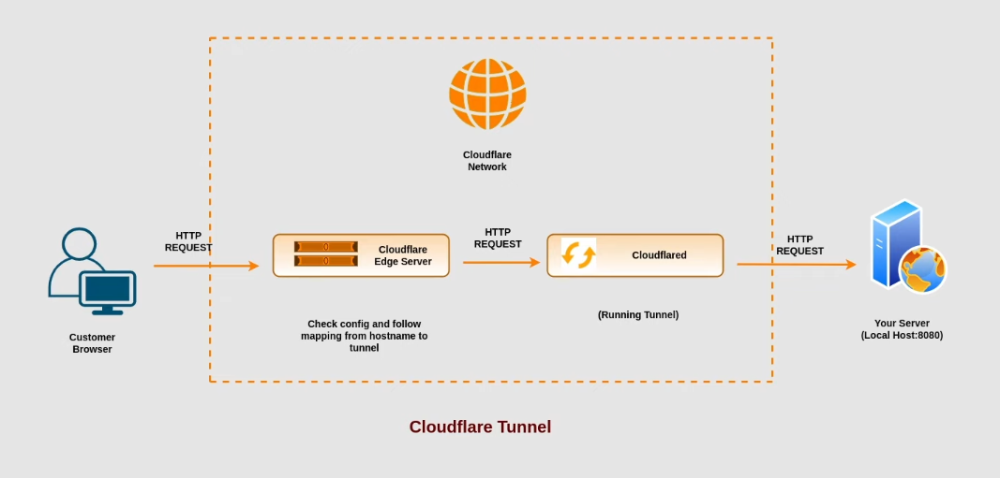

# Tunnel

- Cloudflare Tunnel lets you expose a server (like your EC2 instance, local server) to the internet through Cloudflare without opening any inbound ports on your firewall or router.

- How it normally works without a tunnel:
  - You open port 80/443 on your EC2 security group, point your domain's DNS to your server's public IP, and the world connects directly to your server. Your origin IP is exposed (unless you're already proxying through Cloudflare).

- How Cloudflare Tunnel changes this:
  - You install cloudflared (a lightweight daemon) on your server.
  - cloudflared makes an outbound connection from your server to Cloudflare's edge network.
  - Cloudflare routes incoming requests for your domain through that same tunnel, back to your server.
  - Your server never exposes any public IP or open ports. All traffic is proxied through Cloudflare's network.



## Benefits of using Cloudflare Tunnel:

- You want zero open inbound ports. Right now your EC2 security group almost certainly still allows inbound 80/443 (and probably 22) from the internet, even with orange-cloud proxying — Cloudflare's proxy hides your IP from casual lookups, but if someone finds your real origin IP, those ports are still live and attackable. Tunnel removes that exposure entirely.
- Origin IP must stay completely hidden. Proxy mode (orange cloud) hides the IP in DNS, but determined recon (historical DNS records, SSL cert transparency logs, other subdomains pointing directly at the IP) can still find it. Tunnel means there's nothing to find — no listening service at all.
- You're behind NAT or don't have a public IP, e.g. running a server at home, in a Docker container with no port forwarding, or on a cloud instance without a public IP. Tunnel solves this without any router config.
- You want to expose SSH, RDP, or internal admin panels safely without ever opening those ports publicly. This is one of the strongest use cases — pairs well with Cloudflare Access for authentication.
- You're running multiple internal services (dashboards, dev environments, internal tools) you don't want indexed or scanned by the internet at all.

---

- Cloudflare Tunnel automatically provides HTTPS for the traffic between the internet and Cloudflare's edge network.
- It generates a free SSL certificate for your domain.
- Here is how it works:
  - Edge to Internet: Users visiting your site connect via HTTPS. Cloudflare automatically handles the encryption and issues the certificate.
  - Origin to Edge: You can choose how Cloudflare connects to your local server. It can use HTTPS (with your own local certificate) or HTTP. Because the connection is routed through Cloudflare Tunnel, the traffic is already encrypted and secure.

---

## How to set up Cloudflare Tunnel

### 1. Expose your local server to the internet using temporary tunnel

- Run the following command to expose your local server (running on port 8080) to the internet using a temporary tunnel:

```bash
cloudflared tunnel --url http://localhost:8080
```

- This command will generate a unique URL (e.g., `https://randomstring.trycloudflare.com`) that you can use to access your local server from the internet.

**Pros:**

- Quick and easy to set up for testing or temporary access

**Cons:**

- The URL is temporary and will change each time you run the command

### 2. Token-based (dashboard-managed) — recommended for most setups

You create the tunnel in the Zero Trust dashboard, and Cloudflare gives you a single command to run:

```bash
cloudflared service install <TOKEN>
```

or manually:

```bash
cloudflared tunnel run --token <TOKEN>
```

This registers `cloudflared` as a systemd service. All the routing (which hostname maps to which local service) is configured in the dashboard under Networks → Tunnels, not in a local config file.

**Pros:**

- Fast to set up, good for single-server setups
- You can add/remove public hostnames from the dashboard without touching the server
- No local YAML file to manage

**Cons:**

- Config lives in Cloudflare's dashboard, so it's less portable/version-controllable
- Slightly less flexible for advanced routing rules

### 3.CLI-based (locally-managed) — better for version control / multiple tunnels

```bash
cloudflared tunnel login
cloudflared tunnel create my-tunnel
```

- This generates a credentials JSON file (`~/.cloudflared/<tunnel-id>.json`) and you write a `config.yml` yourself:

- Create dns records for your domain in Cloudflare dashboard, e.g. `app.kavindu.lk` pointing to `my-tunnel`.

```bash
cloudflared tunnel route dns my-tunnel app.kavindu.lk

```

- Then create a `config.yml` file in `~/.cloudflared/`:

```yaml
tunnel: <tunnel-id>
credentials-file: /home/<username>/.cloudflared/<tunnel-id>.json

ingress:
  - hostname: app.kavindu.lk
    service: http://localhost:3000
  - service: http_status:404
```

Then run it with:

```bash
cloudflared tunnel run my-tunnel
```

**Pros:**

- Config file can be committed to a repo (infra-as-code style)
- Easier to script/replicate across multiple servers
- More control over ingress rules in one place

**Cons:**

- More manual setup
- You have to manage the credentials file securely yourself

---

## How to run multiple tunnels on the same server

### 1. Add multiple .service files for diffrent tunnels

- create tunnel from the dashboard and copy the command to run it with the token.

- create a new systemd service file for each tunnel, e.g. `/etc/systemd/system/cloudflared-tunnel1.service` and `/etc/systemd/system/cloudflared-tunnel2.service`, with the following content:

```ini
[Unit]
Description=cloudflared
After=network-online.target
Wants=network-online.target

[Service]
TimeoutStartSec=15
Type=notify
ExecStart=/usr/bin/cloudflared --no-autoupdate tunnel run --token <TOKEN>
Restart=on-failure
RestartSec=5s

[Install]
WantedBy=multi-user.target
```

- create routes in the dashboard for each tunnel to point to different hostnames.

## 2. Using cloudflared CLI

- to be research more about this method
- As i did so far when we login to cloudflared, it uses a domain. So when we create multiple tunnels it only can refer to the same domain. So we need to research more about this method.
